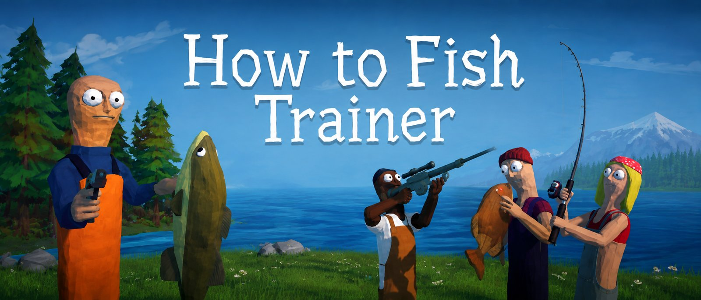
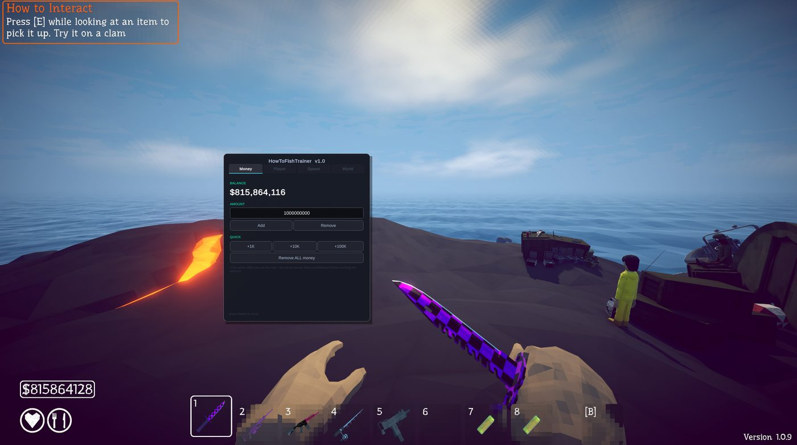
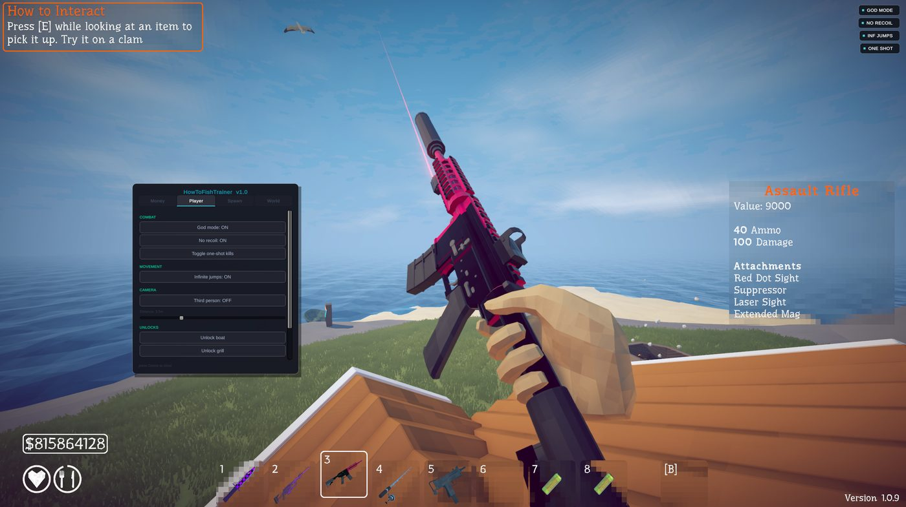
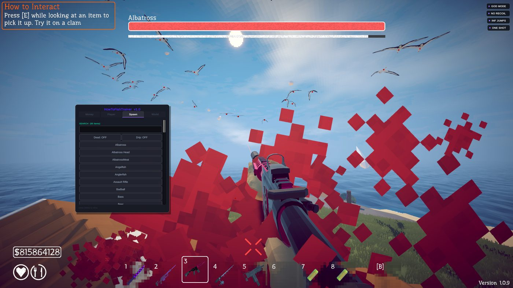
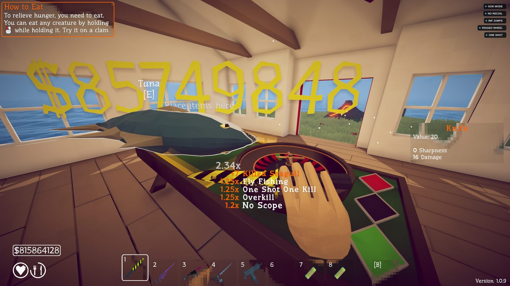

<div align="center">




[**Download on Nexus Mods**](https://www.nexusmods.com/howtofish/mods/54)

</div>

---

Press **Delete** in game.

## Features

**Money** — add or remove any amount, quick +1K / +10K / +100K, wipe to zero

**Player** — god mode, no recoil, one shot kills, infinite jumps, third person, unlock boat / grill / all skins

**Spawn** — every item in the game, searchable. dead and drip variants

**World** — teleport to any island, kill or reset creatures, kill boss, game speed, and a roulette wheel that always lands on your colour (bet green, 35x every time)

Status pills in the corner show what's on.

## Screenshots

<p align="center">




</p>

## Install

1. Grab **ALL-IN-ONE** from [Releases](../../releases)
2. Extract it anywhere
3. Run **INSTALL-WINDOWS.bat**, or **INSTALL-LINUX.sh** on Linux/Deck
4. Launch, press Delete

BepInEx is bundled and the installer finds your game on its own.

Or just extract the zip into your game folder yourself. Same thing.

### Linux / Steam Deck

One extra step, set your launch options to:

```
WINEDLLOVERRIDES="winhttp=n,b" %command%
```

The installer puts that on your clipboard for you.

## Troubleshooting

| Problem | Fix |
| --- | --- |
| Delete does nothing | check `BepInEx/LogOutput.log` exists. no log = BepInEx didn't load |
| No log at all, on Linux | launch options are missing or mistyped |
| Menu opens, buttons do nothing | you're not the host |
| Installer can't find the game | put it in your game folder and run it there |
| Money went negative | it's a 32 bit int, wraps past 2.1 billion. use Remove ALL money |
| Antivirus / Nexus flags `winhttp.dll` | expected, not a virus — see below |

## Notes

Host only. As a guest most of it silently does nothing.

This game has co-op, so spawning and money hit everyone in the lobby, not just you.

Skins are written to your local save. Nothing touches Steam, and Wipe skins undoes it.

`winhttp.dll` gets flagged by some scanners. It works by pretending to be that system DLL so the game loads BepInEx instead — same trick every BepInEx mod uses, and it's a false positive. Use the plugin-only zip if you'd rather not have it and already run BepInEx.

If this is useful to you, a star on the repo is appreciated.

## License

MIT. Bundles [BepInEx](https://github.com/BepInEx/BepInEx) (LGPL-2.1), uses [HarmonyX](https://github.com/BepInEx/HarmonyX).
